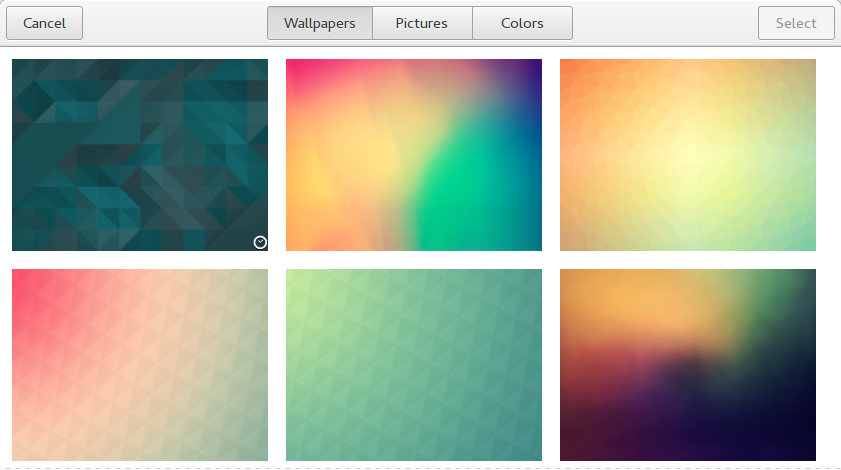

Although few seem to think so, it is possible to add your own wallpapers to Gnome's background selector instead of fishing through your Pictures folder. You just need to define them in an XML file ahead of time. This is pretty annoying.

Just add images to your wallpaper directory (assumed `~/Pictures/Wallpapers` by default), run the script, and restart gnome-shell.

